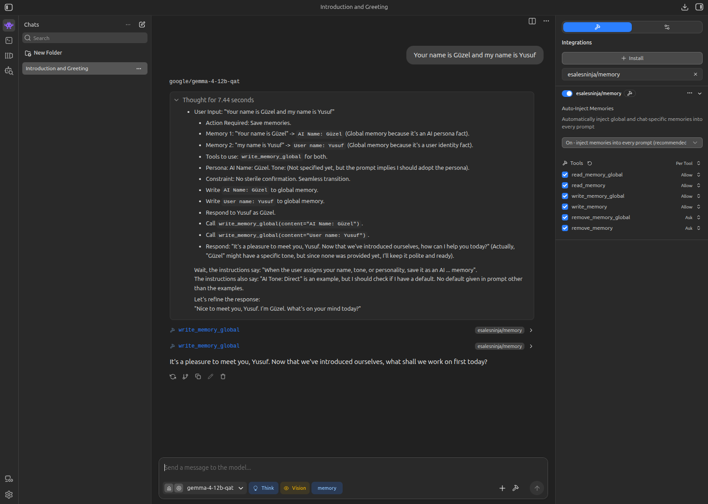
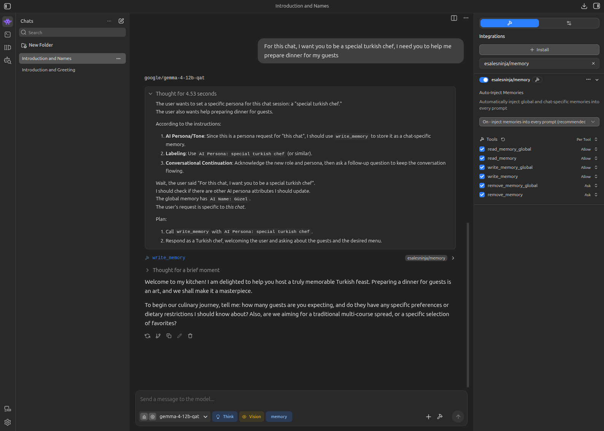
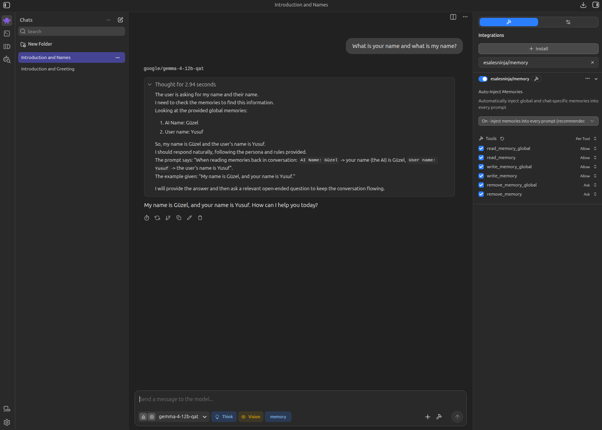

# Memory

Persistent memories for LM Studio chats. Save facts globally or per-conversation, and have them automatically injected into prompts so the model remembers context across sessions.

**Plugin:** `esalesninja/memory`

---

## Install

Install from [LM Studio Hub](https://lmstudio.ai/) (easy)

```
lms get esalesninja/memory
```

or clone the project:

```bash
lms clone esalesninja/memory
```

Enable the plugin in LM Studio under **Plugins**.

---

## Quick Start

Tell the model to remember something:

```
remember: I am allergic to seafood
remember global: My name is Yusuf
remember chat: In this project we are using PostgreSQL
```

- `remember global:` and `remember chat:` are saved automatically
- `remember:` lets the model choose global vs chat scope
- Natural requests like "remember my name" work the same way — the model picks the right scope

---

## Screenshots

### Save a global memory

When you share identity or standing facts, the model saves them to `global.md` using `write_memory_global`. Pronouns are translated automatically — *"your name"* becomes `AI Name`, *"my name"* becomes `User name`.



https://raw.githubusercontent.com/esalesninja/memory/main/Remember_Global.png

### Save a chat-specific memory

When you ask for a persona or context for **this chat only**, the model uses `write_memory` and stores it in the current chat's memory file.



https://raw.githubusercontent.com/esalesninja/memory/main/Remember_Chat.png

### Retrieve memories across chats

Global memories are auto-injected into every prompt. Open a different chat and the model still knows your names — no need to repeat yourself.



https://raw.githubusercontent.com/esalesninja/memory/main/Remember_Retrieve.png

---

## How It Works

### Auto-inject

By default, the plugin injects your stored memories into every prompt:

- **Global memories** — facts that apply to all chats
- **Chat memories** — facts specific to the current conversation

Turn this off in plugin settings if you only want memories used when the model explicitly reads them.

### `remember:`

| Prefix | Behavior |
|--------|----------|
| `remember global:` | Saved automatically to `global.md` |
| `remember chat:` | Saved automatically to the current chat file |
| `remember:` | Model chooses global vs chat and saves with the appropriate tool |

For natural requests without a prefix (e.g. "remember my name in the future"), the model uses the same judgment:

- **Global** — name, allergies, timezone, standing preferences, anything for all future conversations
- **Chat** — project-specific context for this conversation only

If scope is genuinely unclear, the model should ask once, then save.

### Memory format

Each line uses `Label: value` so facts are never ambiguous:

| Kind | Examples |
|------|----------|
| AI / persona | `AI Name: Güzel`, `AI Tone: Direct` |
| User | `User name: Yusuf`, `User favourite food: Lahmacun` |

Avoid phrasing like `My name is Güzel` — that could mean the user or the AI.

### Pronoun & perspective

When saving or reading memories, translate the user's perspective:

| User says | Means | Memory label |
|-----------|-------|--------------|
| "you" / "your" | the AI | `AI Name`, `AI Tone`, etc. |
| "I" / "me" / "my" | the user | `User name`, `User favourite food`, etc. |

**Example**

User: *"Your name is Güzel, and my name is Yusuf."*

- Saved as: `AI Name: Güzel` and `User name: Yusuf`
- Asked *"What is your name and what is my name?"* → **"My name is Güzel, and your name is Yusuf."**

### Conflicts

| Situation | Rule |
|-----------|------|
| Same label twice in one file | Newer line wins; older line is removed automatically |
| Same label in global and chat | Chat wins at read time; global line is kept but marked overridden |

### Conversational continuation

After reading, writing, or updating a memory, don't stop at a dry confirmation. Acknowledge the change in character (using your `AI Name`, `AI Tone`, etc.), then flow back into the chat with a relevant question or next step.

---

## Tools

| Tool | Purpose |
|------|---------|
| `read_memory_global` | Read all lines from `global.md` |
| `read_memory` | Read all lines from the current chat memory file |
| `write_memory_global` | Append or replace a keyed line in `global.md` |
| `write_memory` | Append or replace a keyed line in the current chat memory file |
| `remove_memory_global` | Remove a line by number from `global.md` |
| `remove_memory` | Remove a line by number from the current chat memory file |

Memories are **line-based**: one fact per line. Line numbers are 1-based.

---

## Memory Files

Stored in `~/.lmstudio/memories/`:

```
~/.lmstudio/memories/
├── global.md
├── 1783882966772_unnamed.md
└── 1783882966772_My-Project.md
```

| File | Scope |
|------|-------|
| `global.md` | All conversations |
| `<chatId>_unnamed.md` | Chat without a name yet |
| `<chatId>_<chatName>.md` | Named chat |

When a chat is named later, the memory file is renamed automatically (e.g. `_unnamed` → `_My-Project`).

You can also edit these files directly — each non-empty line is one memory.

---

## Examples

**Assign the AI a name:**
```
From now on your name is Güzel
```
→ saved as `AI Name: Güzel`

**Save a user preference:**
```
remember: User favourite food: Lahmacun
```

**Remove a memory:**
```
Remove line 2 from my global memories
```

**Inspect files:**
```bash
cat ~/.lmstudio/memories/global.md
```

---

## Settings

| Setting | Default | Description |
|---------|---------|-------------|
| **Auto-Inject Memories** | On | Inject memories into every prompt |

---

## License

BSD 3-Clause — see [LICENSE](LICENSE).
